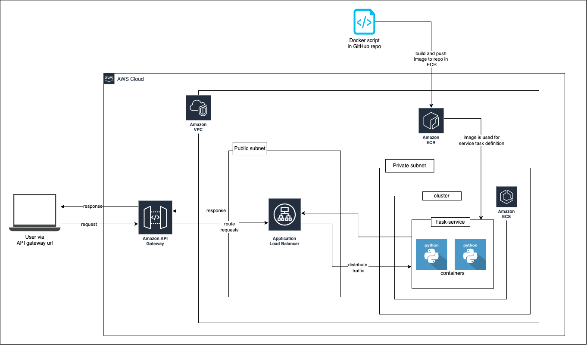

# Architecting Scalable Containerised APIs

## About
Enhancement project for [this project.](https://github.com/khairahscorner/weather-dashboard)

## Extended Features
- Exposes a REST API for the weather dashboard which routes requests to an Application load Balancer 
- Containerised backend (using Amazon ECS with Fargate) scaled up to a minimum count of 2 running tasks
- Application load balancer routes requests to the target group for the service (through a listener)
- Target group distributes requests across healthy running tasks

## Architectural Diagram

## Concepts Learnt
- API management with API Gateway and Load Balancers for security and scalability
- Public/Private subnetting architecture for enhanced resource protection
- Managing environment variables needed in app containerisation (and workflow jobs) with GitHub Actions
- Infrastructure-as-Code with Terraform
- Terraform state maanagement with backend blocks (S3 type)

## Development Process
  - [Documentation](docs.md)
  - [Blog post]()

## Enhancements
- [Enhancement ideas](/enhancements-todo/)